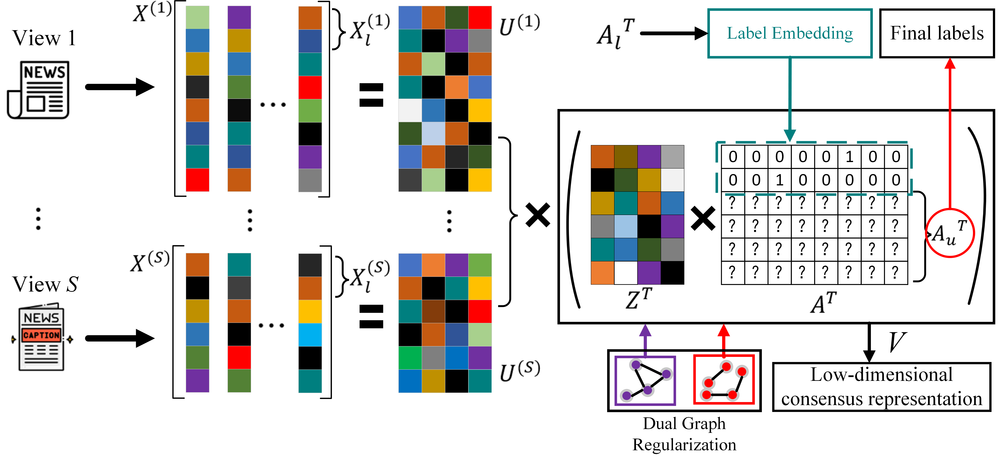

## Multi-view clustering via label-embedded regularized NMF with dual-graph constraints
> **Authors:**
Bin Li, Zhenqiu Shu, Yingbo Liu, Cunli Mao, Shengxiang Gao, Zhengtao Yu

This repo contains the code and data of our Neurocomputing'2023 paper [Multi-view clustering via label-embedded regularized NMF with dual-graph constraints](https://doi.org/10.1016/j.neucom.2023.126521).

<!-- > [Multi-view clustering via label-embedded regularized NMF with dual-graph constraints](https://doi.org/10.1016/j.neucom.2023.126521) -->
## 1. Framework



In this work, we introduce a novel multi-view learning approach, dubbed label-embedded regularized NMF with dual-graph constraints (LeNMF-DC), for clustering. Our proposed LeNMF-DC approach mainly utilizes matrix factorization to obtain a low-dimensional common representation of the multi-view data, in which the prior knowledge hidden in data can be fully explored. Specifically, we construct three graph regularization terms to preserve the manifold structure in the data, feature and label space, respectively. Moreover, we take advantage of the labels of the labeled samples without additional parameters.


## 3.Experiment Results


## 4.Citation

If you find our work useful in your research, please consider citing:

```latex
@article{li2023multi,
  title={Multi-view clustering via label-embedded regularized NMF with dual-graph constraints},
  author={Li, Bin and Shu, Zhenqiu and Liu, Yingbo and Mao, Cunli and Gao, Shengxiang and Yu, Zhengtao},
  journal={Neurocomputing},
  volume={551},
  pages={126521},
  year={2023},
  publisher={Elsevier}
}
```

If you have any problems, contact me via libinishere@gmail.com.


